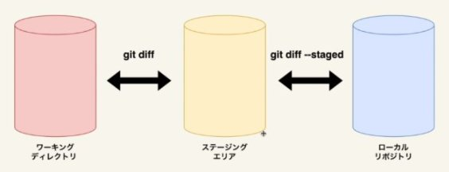

# Git Command

```sh
//初期化
git init

//カレントディレクトリ以下をインデックス
git add .

//コミット
git commit -m "メッセージ"
```

## コミット前の確認

変更を表示

```sh
git status
```

差分表示

```sh
//ステージングエリアとワーキングディレクトリの差分
git diff

//ローカルリポジトリとステージングエリアの差分
git diff --staged
```



ステージングエリアにあるファイルの一覧

```sh
git ls-files
```

## コミット前の取り消し

ファイルの変更を取り消す（↔ diff）

```sh
git restore ファイル名
```

addを取り消す（↔ diff --staged）

```sh
git restore --staged ファイル名
```

## コミット管理

コミット履歴を表示

```sh
git log --oneline --graph --all
```

オプション |              説明
---------- | ------------------------------
--oneline  | 一行で表示
--graph    | グラフ表示
--all      | ブランチも含めた履歴
--grep     | "メッセージの文字列"で絞り込み
-p         | diff情報も表示
-数字      | 最新から数字分の履歴

コミット詳細を表示

```sh
//HEADのあるコミット詳細
git show

//HEADの2つ前のコミット
git show HEAD~2

//そのIDのコミット
git show コミットID

//そのタグがついたコミット
git show タグ名
```

タグをコミットにつける（バージョン情報など）

```sh
//コミットを指定しないと最新のコミットにつく
git tag タグ名 （コミットID）

//注釈付き
git tag -a タグ名 （コミットID） -m "注釈"

//タグ一覧
git tag
```
