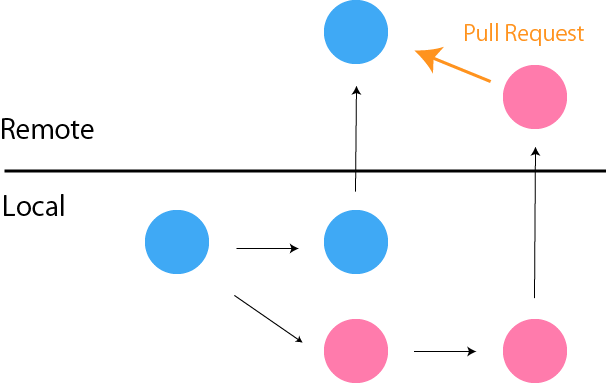
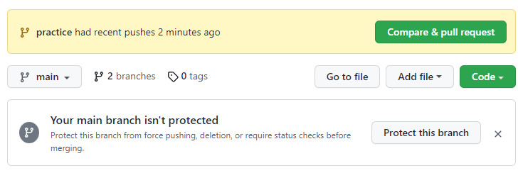

# Git Command

```sh
//初期化
git init

//カレントディレクトリ以下をインデックス
git add .

//コミット
git commit -m "メッセージ"
```

`commit`には`記憶に留める・格納する`といった意味がある

## コミット前の確認

### 変更を表示

```sh
git status
```

### 差分表示

```sh
//ステージングエリアとワーキングディレクトリの差分
git diff

//ローカルリポジトリとステージングエリアの差分
git diff --staged
```

### ステージングエリアにあるファイルの一覧

```sh
git ls-files
```

## コミット前の取り消し

### ファイルの変更を取り消す（↔ diff）

```sh
git restore ファイル名
```

### addを取り消す（↔ diff --staged）

```sh
git restore --staged ファイル名
```

## コミット管理

### コミット履歴を表示

```sh
git log --oneline --graph --all
```

オプション |              説明
---------- | ------------------------------
--oneline  | 一行で表示
--graph    | グラフ表示
--all      | ブランチも含めた履歴
--grep     | "メッセージの文字列"で絞り込み
-p         | diff情報も表示
-数字      | 最新から数字分の履歴

### コミット詳細を表示

```sh
//HEADのあるコミット詳細
git show

//HEADの2つ前のコミット
git show HEAD~2

//そのIDのコミット
git show コミットID

//そのタグがついたコミット
git show タグ名
```

### タグをつける（version情報など）

```sh
//コミットを指定しないと最新のコミットにつく
git tag タグ名 （コミットID）

//注釈付き
git tag -a タグ名 （コミットID） -m "注釈"

//タグ一覧
git tag

//ローカルのタグを削除
git tag -d タグ名 （コミットID）
```

## ブランチ

ブランチは「別ルートのセーブデータ」

### ブランチを作成して切り替え

```sh
git switch -C ブランチ名

git switch //切り替えのみ
```

### ブランチ一覧

```sh
git branch

//リモート追跡ブランチの一覧
git branch -r

//コミットIDとメッセージと追跡リモート付き一覧
git branch -vv

//リモートも含めた全てのブランチ一覧
git branch -a

//ブランチ名変更
git branch -m <old> <new>
```

### ブランチ削除

```sh
//merge済のみ削除
git branch -d ブランチ名

//merge済でなくても削除
git branch -D ブランチ名
```

### 親ブランチ（main等）との変更確認

```sh
git log 親ブランチ..ブランチ //コミット表示

git diff 親ブランチ..ブランチ //差分表示
```

### ブランチの統合

#### merge - 合流 - (fast-forward,no-ff)


```sh
//親ブランチへ移動した後
git merge トピックブランチ

//fast-forwardできる状態でもマージコミットを残す時は
git merge --no-ff トピックブランチ
```

#### merge (squash)

ブランチを分けた時点から最新commitまでの差分が1つにまとまり、親ブランチにaddされる（commit前）
mergeはされない

```sh
git merge --squash トピックブランチ
```

#### rebase - 付け替え -

変更の起点をmainの最新コミットで置き換える
ローカルでのみ使用推奨

```sh
//トピックブランチブランチにいる状態で
git rebase main

//mainへ移動した後、merge
git merge トピックブランチ

```

## リモートリポジトリ

### push

```sh
//上流（upstream）ブランチ（リモート追跡ブランチ）を設定しながらpush
git push -u origin ブランチ名

//上流ブランチを設定しておくとorigin mainは省略できる
git push (origin main)

//ローカルのタグをリモートに同期
git push origin タグ名

//リモートからタグを削除
git push origin --delete タグ名
```

### ローカルにクローン

```sh
//リポジトリ名のフォルダが作成され、クローンされる
git clone リモートリポジトリのクローンURL
```

### リモートリポジトリ

```sh
//リモートリポジトリの一覧
git remote

//fetchやpushする時のURLも表示
git remote -v

//ローカルからリモートリポジトリへ接続
git remote add origin リモートリポジトリのURL

//既にリモートで削除されているブランチを消す
git remote pune origin
```

### リモートリポジトリのコミットを取得

#### fetch

```sh
//リモート追跡ブランチ（origin/main）が更新される
git fetch

//fetchでエラーがあった等で戻したい時
git reset --hard HEAD
```

#### pull

```sh
//fetch + merge
git pull

//fetch + rebase
//ローカルの変更がリモートの後になるので履歴が綺麗
git pull --rebase
```

## コミットの取り消し

### reset（なかった事にする）

```sh
//HEADとmainの位置を1つ前のコミットに戻す
git reset --soft HEAD~1

//ステージングエリアも1つ前に戻す
git reset （--mixed） HEAD

//ワーキングディレクトリも戻す
git reset --hard HEAD

//全てを1つ前に戻す
git reset --hard HEAD~1
```

### revert（取り消しコミットを作る）

```sh
//1つ前に戻したコミットを新たに作成する
git revert HEAD
```

### 取り消したコミットを復元

```sh
//HEADの移動履歴を表示
git reflog

//履歴から戻りたいHEAD位置をコピー・ペースト
git reset --hard HEAD@{1}

//ただしPowerShellではエラーになるため''で囲む
git reset --hard 'HEAD@{1}'
```

### 最新コミットを修正

```sh
git commit --amend -m "修正したコミットメッセージ"
```

### 過去のコミットを修正

```sh
git rebase -i 修正したいコミットの1つ前のコミットID
↓
//修正したいコミットの「pick」を「edit」に変更してSTART
↓
//修正したいファイルを修正
↓
git add .
↓
git commit --amend
↓
git rebase --continue
//continueせず途中で抜けたい場合は
git rebase --abort
```

### コミットを並べ替える

```sh
git rebase -i 並び替えたいコミット達の1つ前のコミットID
↓
//指定コミットにカーソルを置き「alt+矢印」で移動（VSCode）
```

### 過去のコミットを統合

```sh
git rebase -i 統合したいコミット達の1つ前のコミットID
↓
//統合したいコミット（後の方）の「pick」を「squash」に変更
↓
//1つ前のコミットと統合される
```

## プルリクエスト - GitHubの機能 -

- 異なるブランチを統合したい（merge）
- コンフリクトの自動チェック
- mergeする前にコードチェック
- 確認した内容にコメント
- 確認OKならmerge

などをまとめた機能



別ブランチをはじめてPushした時に背景黄色で表示される


