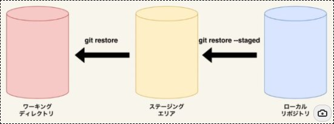

# Git Command

```sh
//初期化
git init

//カレントディレクトリ以下をインデックス
git add .

//コミット
git commit -m "メッセージ"
```

## 確認と取消

```sh
//変更を表示
git status
```

```sh
//ステージングエリアとワーキングディレクトリの差分表示
git diff

//ローカルリポジトリとステージングエリアの差分
git diff --staged
```


```sh
//ファイルの変更を取り消す（↔ diff）
git restore ファイル名

//addを取り消す（↔ diff --staged）
git restore --staged ファイル名
```



```sh
git commit -m "メッセージ" //コミット
```
```sh
git commit -m "メッセージ" //コミット
```
