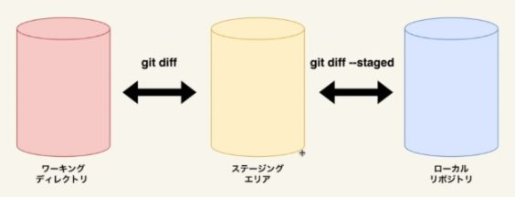

# Git Command

```sh
//初期化
git init

//カレントディレクトリ以下をインデックス
git add .

//コミット
git commit -m "メッセージ"
```

## コミット前の確認

### 変更を表示

```sh
git status
```

### 差分表示

```sh
//ステージングエリアとワーキングディレクトリの差分
git diff

//ローカルリポジトリとステージングエリアの差分
git diff --staged
```



### ステージングエリアにあるファイルの一覧

```sh
git ls-files
```

## コミット前の取り消し

### ファイルの変更を取り消す（↔ diff）

```sh
git restore ファイル名
```

### addを取り消す（↔ diff --staged）

```sh
git restore --staged ファイル名
```

## コミット管理

### コミット履歴を表示

```sh
git log --oneline --graph --all
```

オプション |              説明
---------- | ------------------------------
--oneline  | 一行で表示
--graph    | グラフ表示
--all      | ブランチも含めた履歴
--grep     | "メッセージの文字列"で絞り込み
-p         | diff情報も表示
-数字      | 最新から数字分の履歴

### コミット詳細を表示

```sh
//HEADのあるコミット詳細
git show

//HEADの2つ前のコミット
git show HEAD~2

//そのIDのコミット
git show コミットID

//そのタグがついたコミット
git show タグ名
```

### タグをコミットにつける（バージョン情報など）

```sh
//コミットを指定しないと最新のコミットにつく
git tag タグ名 （コミットID）

//注釈付き
git tag -a タグ名 （コミットID） -m "注釈"

//タグ一覧
git tag
```

## ブランチ

### ブランチを作成して切り替え

```sh
git switch -C ブランチ名

git switch //切り替えのみ
```

### ブランチ一覧

```sh
git branch
```

### ブランチ削除

```sh
git branch -d ブランチ名 //merge済のみ

git branch -D ブランチ名 //merge済でなくても削除
```

### 親ブランチ（main等）との変更確認

```sh
git log 親ブランチ..ブランチ //コミット表示

git diff 親ブランチ..ブランチ //差分表示
```

### ブランチの統合

#### merge - 合流 - (fast-forward,no-ff)


```sh
//親ブランチへ移動した後
git merge トピックブランチ

//fast-forwardできる状態でもマージコミットを残す時は
git merge --no-ff トピックブランチ
```

#### merge (squash)

ブランチを分けた時点から最新commitまでの差分が1つにまとまり、親ブランチにaddされる（commit前）
mergeはされない

```sh
git merge --squash トピックブランチ
```

#### rebase - 付け替え -

変更の起点をmainの最新コミットで置き換える
ローカルでのみ使用推奨

```sh
//トピックブランチブランチにいる状態で
git rebase main

//mainへ移動した後、merge
git merge トピックブランチ

```